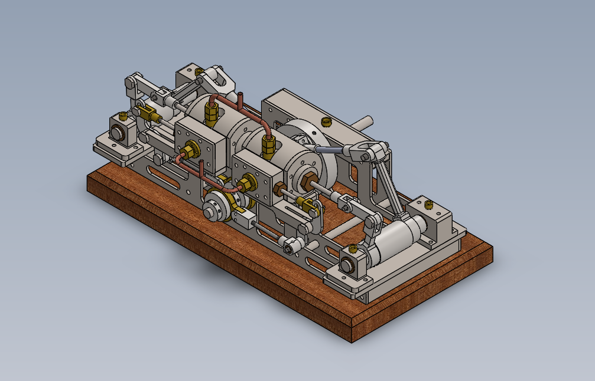

# Horizontal Steam Engine (Monitor Type) — SolidWorks Assembly

---

## Overview

A fully parametric 3D CAD model of a classic horizontal steam engine, designed and 
assembled in SolidWorks as part of the ME202 Machine Drawing course at IIT Ropar.

This project models a **Monitor-type horizontal steam engine** — a single-cylinder 
design historically used in early industrial machinery. The assembly demonstrates 
core mechanical engineering concepts including slider–crank kinematics, load-bearing 
structure, and multi-body constrained assembly.

**Course:** ME202 – Machine Drawing  
**Institution:** IIT Ropar (Indian Institute of Technology, Ropar)

---

## Demo

[Watch Animation](Project_Animation.mp4)

---

## Assembly Highlights

- 70+ individual components including cylinder assembly, piston rod, crankshaft,
  connecting rod, bearings, guides, mounting plates, and fasteners
- Realistic material assignments — aluminium, cast iron, copper, brass, bronze,
  and stainless steel
- Fully constrained assembly using concentric, coincident, and distance mates
- Complete motion representation — piston → connecting rod → crankshaft rotation

---

## Files

| Folder/File | Contents |
|---|---|
| `Parts/` | Individual SolidWorks part files (.SLDPRT) |
| `Assembly/` | Sub-assemblies and final top-level assembly (.SLDASM) |
| `Source/` | Source reference drawing PDFs |
| `Final_drawing.pdf` | Engineering drawing with orthographic views and BOM |
| `ME202_Project_Report_2024MEB1375.pdf` | Project report |
| `Isometric_view.png` | Assembly render |
| `Project_animation.mp4` | Motion animation video |

---

## Engineering Drawing

The drawing includes orthographic views (front, top, side), a Bill of Materials, and a standard title block.

---

## Skills Demonstrated

- 3D part modelling and multi-body constrained assembly in SolidWorks
- Sub-assembly and top-level assembly design
- Engineering drawing and documentation
- Material selection for mechanical components

---

## Reference

Design blueprints sourced from **JDW Draughting Services, New Zealand**.
